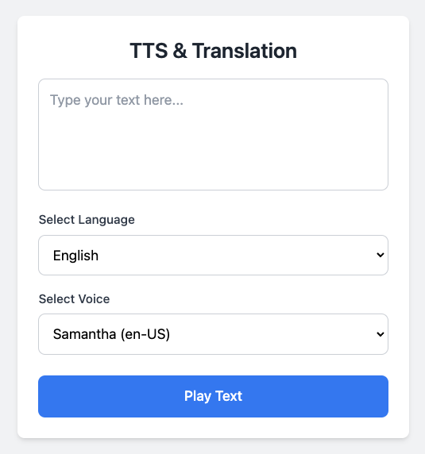

# TTS & Translate App

JavaScript web app that does text-to-speech and language translation using the Web Speech API, Google Translate and Vercel serverless functions.



## Usage

Create your Google API key and create a `.env` file and add the following:

```
GOOGLE_TRANSLATE_API_KEY=YOUR_KEY
```

Install Dependencies:

```bash
npm install
```

Run The Vercel CLI

```bash
vercel dev
```

Open http://localhost:3000 in your browser

The serverless function is located in the `/api/translate.js` file and can be accessed with the endpoint `/api/translate`
